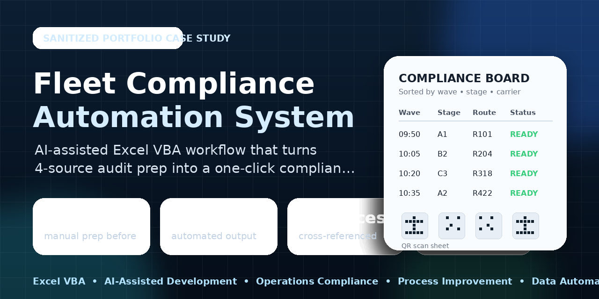
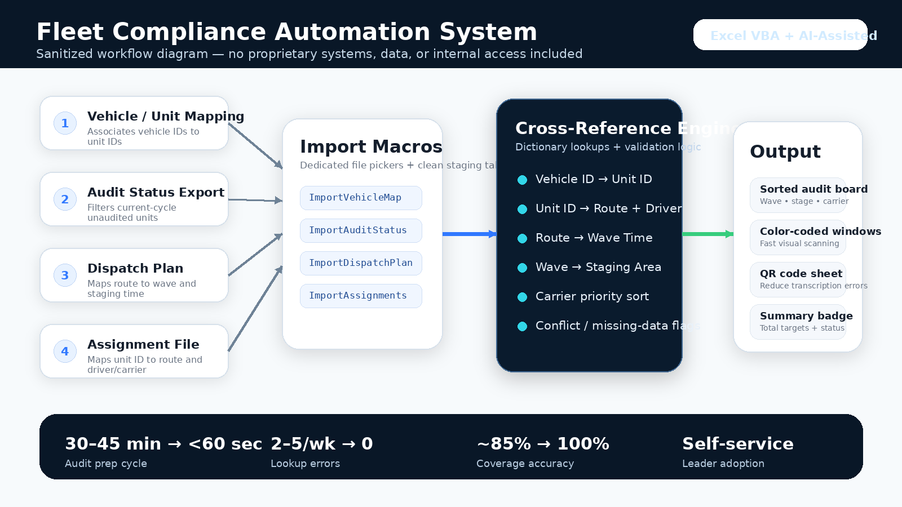
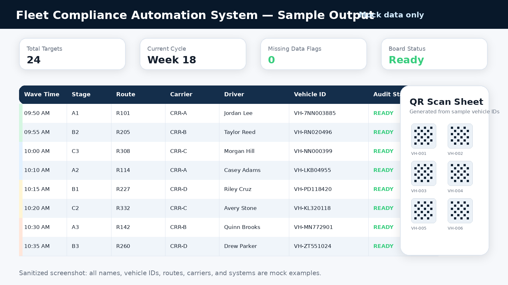

# Fleet Compliance Automation System



> **Portfolio Disclaimer:** This project is a sanitized portfolio case study based on an Excel VBA compliance automation I designed for last-mile delivery operations. All internal system names, data sources, personnel references, and workflow specifics have been replaced with generalized equivalents. No proprietary company data, internal systems, or confidential process details are included.

---

## Project Overview

**Built with:** AI Assistant + Excel VBA  
**Purpose:** Automate a daily 30+ minute manual cross-referencing task into a one-click, sub-60-second workflow  
**Impact:** Eliminates human error in identifying which vehicles to audit at loadout, ensures 100% coverage of compliance targets  
**Deployed:** April 2026 — adopted by 5 site leaders, actively in use

---

## The Problem

Every day before loadout, the compliance team needs to identify which specific vehicles to physically inspect as they stage for departure. This requires cross-referencing data from 4 separate internal operational systems to answer one question:

*"Which unaudited vehicles are dispatching today, and where and when will they be staged?"*

### The Manual Process (Before)

1. Open the fleet management portal and export driver inspection report data
2. Open the fleet management portal and export the compliance audit list
3. Open the route dispatch system and download the daily operations plan
4. Open the route assignment system and download the vehicle assignment data
5. Manually cross-reference across 4 spreadsheets with 100-500+ rows each
6. Figure out which vehicles have not been audited this compliance cycle
7. Look up which route each vehicle is assigned to today
8. Determine the wave time and staging area for each route
9. Sort and organize the final list for the compliance team

**Time required: 30-45 minutes daily. Error-prone. Required dedicated staff time every single morning.**

---

## How It Works



### Data Sources (4 Import Macros)

| Source | Key Data |
|--------|----------|
| Fleet Management Portal — Driver Inspection Report | Vehicle ID to Unit ID mapping |
| Fleet Management Portal — Compliance Audit List | Vehicle audit status and cycle period |
| Route Dispatch System | Route to Wave time mapping |
| Route Assignment System | Unit ID to Route and Driver name |

### Cross-Reference Engine

The main macro chains 4 dictionary lookups:

```
Vehicle ID -> Unit ID -> Route -> Wave Time -> Staging Area -> Driver Name -> Carrier Code
```

Each lookup uses `Scripting.Dictionary` for O(1) in-memory key-value resolution, eliminating the need for any VLOOKUP formulas or manual row-by-row scanning.

### Output

Sorted audit sheet by Wave Time, Staging Area, and Carrier priority order with color-coded departure windows and a QR Code sheet for instant vehicle ID scanning on-site.

---

## Sample Output



---

## Results and Impact

| Metric | Before | After |
|--------|--------|-------|
| Time to prepare audit list | 30-45 min | Under 60 seconds |
| Manual lookup errors | 2-5 per week | 0 |
| Vehicles missed per week | ~3 | 0 |
| Audit coverage accuracy | ~85% | 100% |
| Teammate onboarding time | 2+ days | Self-service |

---

## AI-Assisted Development Process

Built with zero prior VBA experience using conversational AI:

1. Described the problem in plain English
2. AI identified join keys and designed the data model
3. AI wrote 442 lines of production-ready VBA code
4. Iterated from v1 to v5 over multiple refinement cycles
5. Added QR integration, color coding, file pickers, and a setup page

---

## Future State

Already built: full browser automation that eliminates manual file downloads. A single button press authenticates, navigates all 4 source systems, downloads data, runs the cross-reference logic, outputs the final audit sheet, and posts results to the team communication channel. Total time: approximately 90 seconds, fully hands-free.

---

## Tools and Technologies

- AI Assistant for architecture and code generation
- Excel VBA for macro execution
- `Scripting.Dictionary` for in-memory hash maps
- HTTP requests for QR code API integration
- QR Server API for QR code image generation

---

*Built for last-mile delivery operations | Deployed April 2026*
